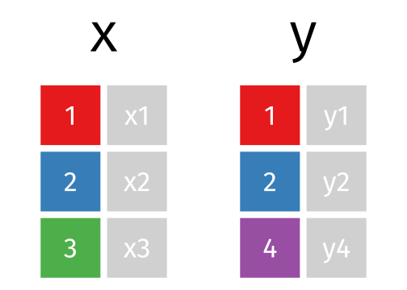

background-image: url(https://github.com/m-clark/m-clark.github.io/raw/master/img/Rlogo.svg)

```{r setup, include=FALSE}
options(htmltools.dir.version = FALSE)

knitr::opts_chunk$set(
  # code
  echo      = T,
  eval      = F,
  message   = F,
  warning   = F,
  error     = F,
  comment   = NA,
  R.options = list(width = 220),
  # viz
  dev.args  = list(bg = 'transparent'),
  dev       = 'svglite',
  fig.align = 'center',
  out.width = '75%',
  fig.asp   = .75,
  # cache
  cache.rebuild = F,
  cache         = F
)

kable_df = function(data, digits=3, ...) {
  kableExtra::kable(
    data,
    digits = digits,
    format = 'html',
    booktabs = T,
    # longtable = F,
    linesep = "",
    ...,
  ) %>% 
    kableExtra::kable_styling(full_width = F)
}

perc = function(x, digits = 1) paste(rnd(x*100, digits = digits), '%')
```


---
class: inverse, center, middle

# Data Structures

<i class="fas fa-database fa-5x"   aria-hidden="true"></i><span class="" style = "margin-right: 25px"></span>
<i class="fas fa-code fa-5x" style = 'color:#1f65b7'></i>

---
class: inverse

# Data Structures

- Vectors
- Matrices
- Lists
- Data Frames

---
class: inverse

# Data Structures: Vectors

- *Character strings *

```{r}
string = c('a', 'q')
```

- *Factors*

```{r}
factor(string)
```

How are they different?

---
class: inverse

# Data Structures: Vectors

- Logicals

```{r}
my_logic = c(TRUE, FALSE, TRUE)
```


- Numeric and integers

```{r}
x = c(1, 2.5, 3)
```

---
class: inverse

# Data Structures: Matrices & Data Frames

- *Matrices*: still must be all the same type!

```{r}
x = 1:4
y = 5:8
z = 9:12

cbind(x, y, z)   # column bind
```

- *Data Frame*: Mix it up!

```{r}
my_df = data.frame(x = 1:2, y = c('a', 'b'))
```


---
class: inverse

# Data Structures: Lists

Data frames are flexible because they are lists

```{r}
list(1, '1', my_df)
```

Most R objects you deal with are lists!

- Data frames, model objects, plots, etc.


---
class: inverse

# Data Structure Exercises

- Exercise 1

  - Create an object that is a matrix and/or a data.frame, and inspect its class or structure (use the class or str functions on the object you just created).

- Exercise 2

  - Create a list of 3 elements, the first of which contains character strings, the second numbers, and the third, the data.frame or matrix you just created in Exercise 1.

- Thinking Exercises

  - How is a factor different from a character vector?
  - How is a data.frame the same as and different from a matrix?
  - How is a data.frame the same as and different from a list?


---
class: inverse, center, middle

# Input/Output

<i class="fas fa-file-import fa-5x" ></i>
<span class="" style = "margin-right: 25px"></span>
<i class="fas fa-file-export fa-5x" ></i>


---
class: inverse

# Input/Output

Primary packages:

- readr
  - write_csv, read_csv
- haven
  - other statistical packages (e.g. Stata)
- base R
  - save, save.image, load
  - readRDS, saveRDS

```{r}
my_data = readr::read_csv('some_file.csv')

load('my_saved_R_objects.RData')
```

---
class: inverse

# Input/Output Exercises

Read this csv (or any in your project folder):

https://raw.githubusercontent.com/m-clark/data-processing-and-visualization/master/data/cars.csv


---
class: inverse, center, middle

# Indexing



---
class: inverse

# Indexing: Slicing

How do I extract:
- elements
- columns/rows
- subsets
- ...?

```{r}
letters[4:6]        # lower case letters a-z

myMatrix[1, 2:3]    # matrix[rows, columns]

mydf['row1', 'b']   # data frame by name

mydf[mydf$a >= 2, ] # boolean
```


---
class: inverse

# Indexing: List extraction

*[* : grab a slice of elements/columns

*[[* : grab specific elements/columns

*$* : grab specific elements/columns

*@*: extract slot for S4 objects


```{r}
my_list_or_df[2:4]

my_list_or_df[['name']]

my_list_or_df$name
```


---
class: inverse

# Indexing: Exercises


.pull-left[

Here is a matrix, a data.frame and a list.


```{r }
mymatrix = matrix(
  rnorm(100), 
  nrows = 10, 
  ncols = 10
)

mydf = mtcars

mylist = list(
  mat = mymatrix, 
  thisdf = mydf
)
```

]

.pull-right[
- Exercise 1
    - For the matrix, in separate operations, take a slice of rows, a selection of columns, and a single element.
- Exercise 2
    - For the data.frame, grab a column in 3 different ways.
- Exercise 3
    - For the list, grab an element by number and by name.
]


---
class: tidyverse
background-image: url(img/tidyverse.png)


<!-- # Tidyverse -->

<!--  -->

---
class: inverse

# Tidyverse

What is the *tidyverse*?

```{r eval=TRUE, message=TRUE, warning=TRUE, echo=-2}
library(tidyverse)
tidyverse::tidyverse_logo()
```

```
── Attaching packages ────────────── tidyverse 1.3.0 ──
✓ ggplot2 3.3.2     ✓ purrr   0.3.4
✓ tibble  3.0.3     ✓ dplyr   1.0.2
✓ tidyr   1.1.2     ✓ stringr 1.4.0
✓ readr   1.3.1     ✓ forcats 0.5.0
```


---
class: inverse

# Tidyverse: Packages

- <span class="pack" style = "">ggplot2</span>: data visualization
- <span class="pack" style = "">tibble</span>: a re-imagining of data frames
- <span class="pack" style = "">tidyr</span>: data tidying
- <span class="pack" style = "">readr</span>: data import
- <span class="pack" style = "">purrr</span>: functional programming
- <span class="pack" style = "">dplyr</span>: data manipulation
- <span class="pack" style = "">stringr</span>: string processing
- <span class="pack" style = "">forcats</span>: easier factors


---
class: inverse

# Tidyverse: Tidiness

What is *tidy data*?

- Arranged in a way that makes processing, analysis, and visualization simpler.

In a tidy data set:

  - Each variable must have its own column.
  - Each observation must have its own row.
  - Each value must have its own cell.


---
class: inverse

# Tidyverse: dplyr

The workhorse package.

It has three main goals:

  - Make the most important data manipulation tasks *easier*.
  - Do them *faster*.
  - Use the same interface to work with data frames, data tables or a database.

---
class: inverse

# Tidyverse: dplyr

Some key operations include:

- <span class="func">select</span>: grab columns
    - select helpers: <span class="func">one\_of</span>, <span class="func">starts\_with</span>, <span class="func">num_range</span> etc.
- <span class="func">filter</span>/<span class="func">slice</span>: grab rows
- <span class="func">group_by</span>: grouped operations
- <span class="func">mutate</span>/<span class="func">transmute</span>: create new variables
- <span class="func">summarize</span>: summarize/aggregate


---
class: inverse

# Tidyverse: Piping

The pipe:

<div style = "text-align:center">
<h1><span class="" style = "color: #ECD078FF; font-size: 2em; vertical-align: top;">%>%</span> 
</div>

What goes before is provided as the first argument to the subsequent function.

```{r}
mydata %>% summary()
```


---
class: inverse

# Tidyverse: Example


```{r bball, eval=-4, echo=-(1:4)}
# load('../../data-processing-and-visualization/data/bball.RData') # for you
load(url('https://github.com/m-clark/data-processing-and-visualization/raw/master/data/bball.RData')) # moon reader server
bball = as_tibble(bball)

load('data/bball.RData')
str(bball[,1:5])
```


---
class: inverse

# Tidyverse: Selecting columns

```{r eval=T}
bball %>% 
  select(Player, Tm, Pos) %>% 
  head()
```

Use the *-* in front of the name to drop.

---
class: inverse

# Tidyverse: Selecting columns

Select helpers:

- <span class="func">starts_with</span>: starts with a prefix
- <span class="func">ends_with</span>: ends with a suffix
- <span class="func">contains</span>: contains a literal string
- <span class="func">matches</span>: matches a regular expression
- <span class="func">num_range</span>: a numerical range like x01, x02, x03.
- <span class="func">one_of</span>: variables in character vector.
- <span class="func">everything</span>: all variables.

```{r}
bball %>% 
  select(starts_with('p'), contains('3'))
```
 


---
class: inverse

# Tidyverse: Filtering rows

Filtering requires input that can be converted to a logical vector.

```{r eval=T}
bball = bball %>% 
  filter(Rk != "Rk")
```


```{r eval=T}
bball %>% 
  filter(Age > 35, Pos == "SF" | Pos == "PF") %>% 
  distinct(Player, Pos, Age) 
```

---
class: inverse

```{r eval=T}
str(bball)
```

---
class: inverse

# Tidyverse: Generating New Data

```{r, eval=1}
bball = bball %>% 
  mutate(across(c(-Player, -Pos, -Tm), as.numeric))
```


```{r eval = T}
bball = bball %>% 
  mutate(
    trueShooting = PTS / (2 * (FGA + (.44 * FTA))),
    effectiveFG  = (FG + (.5 * X3P)) / FGA,
    shootingDif  = trueShooting - FG.
  )
```


---
class: inverse

# Tidyverse: Grouping & Summarizing

Another very common task is to look at group-based statistics, and we can use <span class='func'>group_by</span> and <span class="func">summarize</span> to help us.

```{r eval=TRUE}
bball %>%   
  group_by(Pos) %>%                                                 
  summarize(
    `Mean FG%` = mean(FG., na.rm = TRUE),
    `Mean True Shooting` = mean(trueShooting, na.rm = TRUE)
  )    
```

```{r}
bball %>% 
  mutate(
    Pos = case_when(
      Pos == 'PG-SG' ~ 'PG',
      Pos == 'C-PF'  ~ 'C',
      Pos == 'SF-SG' ~ 'SF',
      Pos == 'PF-C'  | Pos == 'PF-SF' ~ 'PF',
      Pos == 'SG-PF' | Pos == 'SG-SF' ~ 'SG',
      TRUE ~ Pos
    )) %>% 
  nest_by(Pos) %>%     
  mutate(FgFt_Corr = list(cor(data$FG., data$FT., use = 'complete'))) %>% 
  unnest(c(Pos, FgFt_Corr))
```

---
class: inverse

# Tidyverse: Renaming Columns

Standard approach.

```{r}
data %>% 
  rename(new_name = old_name,
         new_name2 = old_name2)
```

More complex.

```{r}
bball %>%
  rename_with(
    str_replace,      # function
    contains('.'),    # columns
    pattern = '\\.',  # function arguments
    replacement = '%'
  ) %>% 
  rename_with(str_remove, starts_with('X'), pattern = 'X') %>%
  colnames()
```


---
class: inverse

# Tidyverse: Merging

<span class="func">inner_join</span>: return all rows from x where there are matching values in y, and all columns from x and y. 

<span class="func">left_join</span>: return all rows from x, and all columns from x and y. 

<span class="func">right_join</span>: return all rows from y, and all columns from x and y. 

---
class: inverse

# Tidyverse: Merging


<span class="func">semi_join</span>: return all rows from x where there are matching values in y, keeping just columns from x. 

<span class="func">anti_join</span>: return all rows from x where there are not matching values in y, keeping just columns from x.

<span class="func">full_join</span>: return all rows and all columns from both x and y. 

---
class: inverse

# Tidyverse: Merging

```{r, echo=-(1:2), message=TRUE, eval=TRUE}
band_members = tibble(
  Name = c('Seth', 'Francis'),
  Band = c('Com Truise', 'Pixies')
)
band_instruments = tibble(
  Name = c('Francis', 'Bubba', 'Seth'),
  Instrument = c('Guitar', 'Guitar', 'Synthesizer')
)

band_members
band_instruments
```


---
class: inverse

# Tidyverse: Merging


```{r eval=T}
left_join(band_members, band_instruments)
```

```{r eval=T}
full_join(band_members, band_instruments)
```

---
class: inverse

# Tidyverse: Pivoting

Pivoting involves reshaping the data.


<span class="func">pivot_longer</span>: convert data from a wider format to longer one

<span class="func">pivot_wider</span>:  convert data from a longer format to wider one

<!-- {width:30%} -->


---
class: inverse

# Tidyverse: Pivoting

---
class: inverse

# Tidyverse: Pivoting

```{r}
library(tidyr)

stocks <- data.frame(
  time = as.Date('2009-01-01') + 0:9,
  X = rnorm(10, 0, 1),
  Y = rnorm(10, 0, 2),
  Z = rnorm(10, 0, 4)
)

stocks %>% 
  pivot_longer(
    cols      = -time,   # works similar to using select()
    names_to  = 'stock', # the name of the column that will have column names as labels
    values_to = 'price'  # the name of the column for the values
  ) %>% 
  head()
```


---
class: inverse

# Tidyverse: More


---
class: inverse

# Tidyverse: Exercises

### Exercise 0

Install and load the <span class="pack">dplyr</span> <span class="pack">ggplot2movies</span> packages. Look at the help file for the `movies` data set, which contains data from IMDB.


```{r}
install.packages('ggplot2movies')

data('movies', package = 'ggplot2movies')
```

---
class: inverse

# Tidyverse: Exercises

### Exercise 1a

Use <span class="func">mutate</span> to create a centered version of the rating variable.  A centered variable is one whose mean has been subtracted from it. The process will take the following form:

```{r ex1a_1, eval=FALSE}
data %>% 
  mutate(new_var_name = '?')
```

```{r ex1a_2, echo=FALSE, eval=FALSE}
movies %>% 
  mutate(ratingCen = rating - mean(rating)) 
```


---
class: inverse

# Tidyverse: Exercises

### Exercise 1b

Use <span class="func">filter</span> to create a new data frame that has only movies from the years 2000 and beyond. Use the greater than or equal operator `>=`.

```{r ex1b, echo=FALSE, eval=FALSE}
movies %>% 
  filter(year >= 2000) 
```

### Exercise 1c

Use <span class="func">select</span> to create a new data frame that only has the `title`, `year`, `budget`, `length`, `rating` and `votes` variables.  There are at least 3 ways to do this.

```{r ex1c, echo=FALSE, eval=FALSE}
movies %>% 
  select(title, year, budget, length, rating, votes) 
movies %>% 
  select(1:6)
movies %>% 
  select(-num_range('r',1:10), -mpaa, -starts_with('A'), -Comedy, -starts_with('D'), -Romance, -Short)
```

---
class: inverse

# Tidyverse: Exercises

### Exercise 1d

Rename the `length` column to `length_in_min` (i.e. length in minutes).


---
class: inverse

# Tidyverse: Exercises

### Exercise 2

Use <span class="func">group_by</span> to group the data by year, and <span class="func">summarize</span> to create a new variable that is the average budget. The <span class="func">summarize</span> function works just like <span class="func">mutate</span> in this case.

Use the <span class="func">mean</span> function to get the average, but you'll also need to use the argument `na.rm = TRUE` within it because the earliest years have no budget recorded.


```{r ex2, echo=FALSE, eval=FALSE}
movies %>% 
  group_by(year) %>% 
  summarise(AvgBudget=mean(budget, na.rm=T)) %>% 
  tail
```

---
class: inverse

# Tidyverse: Exercises

### Exercise 3

Use <span class="func">pivot_longer</span> to create a 'tidy' data set from the following.

```{r ex3, eval=FALSE, echo=1:3}
dat = tibble(id = 1:10,
             x = rnorm(10),
             y = rnorm(10))
dat %>% pivot_longer(key = var, value = score, -id)
```

---
class: inverse

# Tidyverse: Exercises


### Exercise 4

Now put several actions together in one set of piped operations. 

- Filter movies released *after* 1990
- select the same variables as before but also the `mpaa`, `Action`, and `Drama` variables
- group by `mpaa` *and* (your choice) `Action` *or* `Drama`
- get the average rating

It should spit out something like the following:

```{r ex4, echo=FALSE}
movies %>%
  filter(year>=1990) %>% 
  select(title, year, budget, length, rating, votes, mpaa, Action, Drama) %>% 
  group_by(mpaa, Drama) %>% 
  summarise(AvgRating = mean(rating))
```


---

class: inverse, center, middle

# Other Stuff


